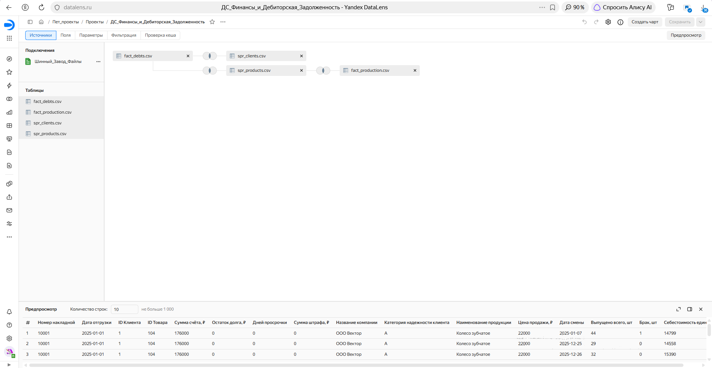
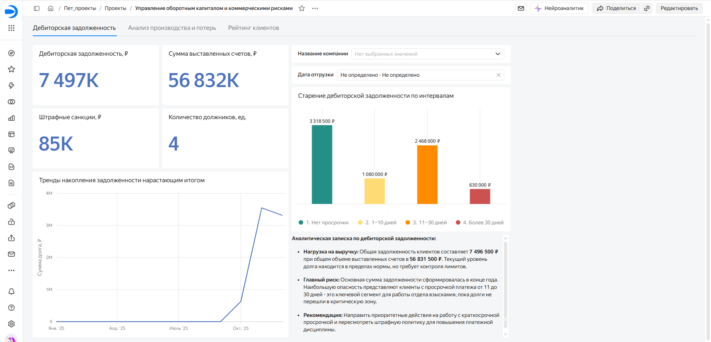
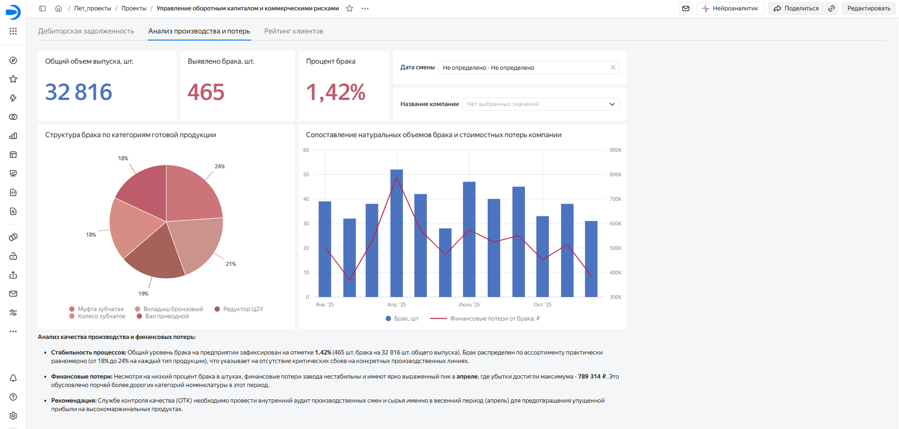
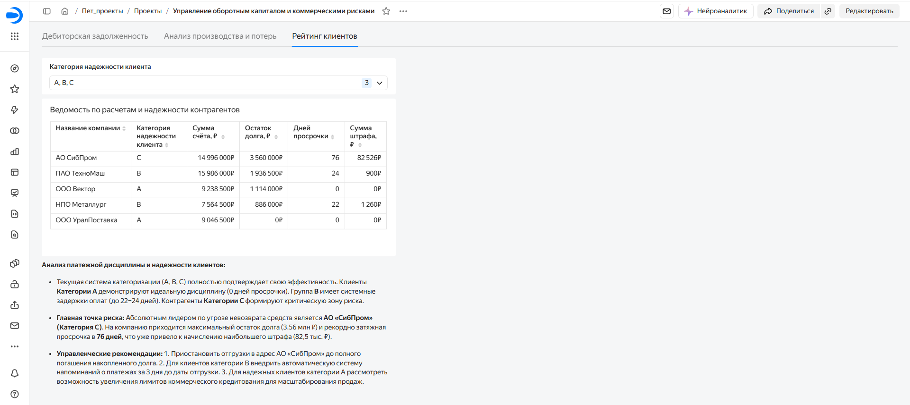

# Сквозной BI-проект: Оптимизация оборотного капитала и производственный аудит в Yandex DataLens

## 📌 Бизнес-контекст и задачи
Эффективное управление оборотным капиталом — ключевой фактор финансовой устойчивости производственно-торговых предприятий. Зависание денежных средств в дебиторской задолженности повышает риск кассовых разрывов, а операционные потери от технологического брака снижают общей рентабельности бизнеса.

В рамках проекта реализовано аналитическое решение для операционного и финансового менеджмента: консолидация транзакционных данных по отгрузкам, платежам и производственному выпуску, оценка платежной дисциплины контрагентов и финансовая квалификация производственных дефектов.

**Ключевые цели проекта:**
1. Автоматизация контроля дебиторской задолженности по интервалам просрочки (Aging Report).
2. Трансформация натуральных показателей производственного брака (шт.) в финансовые эквиваленты потерь (₽).
3. Создание инструмента коммерческого скоринга клиентов для минимизации кредитных рисков.

---

## 🛠 Архитектура данных и моделирование

Проект реализован с использованием СУБД и BI-платформы, что обеспечивает полную воспроизводимость и проверку сходимости данных:
* **Валидация данных в PostgreSQL / DBeaver:** Исходные данные проверены с помощью SQL-запросов (агрегация сумм, группировка интервалов просрочки через `CASE WHEN`, расчет стоимости брака) для исключения дублей и ошибок моделирования до переноса в BI.
* **Моделирование в Yandex DataLens:** Логическая модель данных развернута по аналитической схеме **«Звезда» (Star Schema)**.

### Компоненты репозитория:
* `sql/analytical_queries.sql` — SQL-скрипты для предварительного аудита данных, валидации сумм и расчета показателей.
* `data/` — исходные наборы данных (транзакции и справочники).
* `dashboards/` — снимки экрана готового дашборда и схемы данных.

### Компоненты модели данных:
* **Таблицы фактов (Центр звезды):** `fact_debts` (транзакции отгрузок и оплат), `fact_production` (учет выпуска и брака).
* **Таблицы измерений:** `spr_clients` (профили клиентов, категории риска), `spr_products` (номенклатурный справочник, цены).
  

---

## 📊 Структура дашборда и ключевые инсайты

Дашборд спроектирован по принципу «от общего к частному» (Summary to Detail) и включает 3 функциональные страницы.

### Лист 1. Управление дебиторской задолженностью
* **Верхнеуровневые KPI:** Совокупный остаток задолженности составляет **7,50 млн ₽** при общем объеме выставленных счетов **56,83 млн ₽** (доля задолженности — 13,2%).
* **Анализ старения долга (Aging Analysis):** 44,3% задолженности находится в пределах планового периода погашения. Ключевая зона операционного риска (**2,47 млн ₽** / 32,9%) сконцентрирована в интервале краткосрочной просрочки 11–30 дней.
* **Управленческое решение:** Фокусировка службы взыскания на сегменте 11–30 дней до их перехода в категорию безнадежных долгов.

---

### Лист 2. Производственный аудит и финансовые потери
* **Операционные показатели:** Совокупный объем выпуска за период — **32 816 шт.**, объем брака — **465 шт.** (средняя норма дефектности Scrap Rate — **1,42%**).
* **Оцифровка потерь:** На основе стоимости единицы продукции выявлен аномальный сезонный пик прямых убытков в апреле — **789 314 ₽** (при среднемесячном показателе ~520 тыс. ₽).
* **Управленческое решение:** Инициирование внепланового аудита технологических регламентов и работы смен в весенний период.

---

### Лист 3. Коммерческий скоринг и рейтинг клиентов
* **Реестр контрагентов:** Табличный отчет с ранжированием клиентов по объему задолженности и категориям надежности (A, B, C).
* **Локализация рисков:** Выявлен ключевой проблемный контрагент группы риска C — **АО «СибПром»**, на которого приходится **3,56 млн ₽** остатка долга при задержке выплат до 76 дней.
* **Управленческое решение:** Приостановка коммерческого кредитования и переход на условия 100% предоплаты для контрагентов с высоким уровнем риска.

